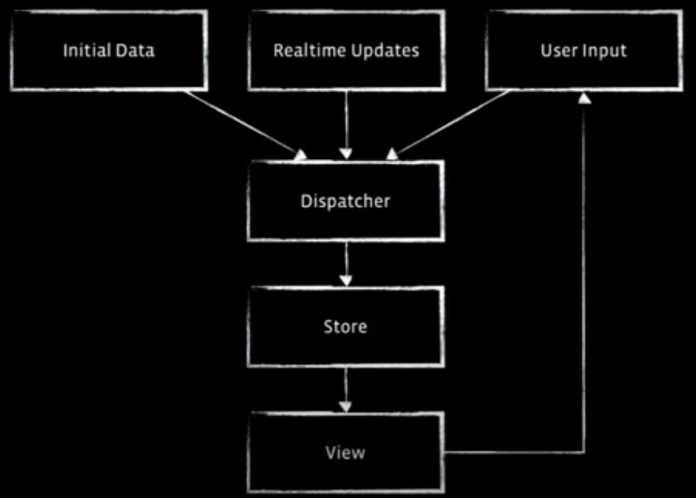

# React

## React Component 生命周期

React Component，就像人会有生老病死一样有生命周期。一般而言 Component 有以下三种生命周期的状态：

1. Mounting：已插入真实的 DOM
2. Updating：正在被重新渲染
3. Unmounting：已移出真实的 DOM

针对 Component 的生命周期状态 React 也有提供对应的处理方法：

1. Mounting
   - componentWillMount()
   - componentDidMount()
2. Updating
   - componentWillReceiveProps(object nextProps)：已载入组件收到新的参数时呼叫
   - shouldComponentUpdate(object nextProps, object nextState)：组件判断是否重新渲染时呼叫，起始不会呼叫除非呼叫 forceUpdate()
   - componentWillUpdate(object nextProps, object nextState)
   - componentDidUpdate(object prevProps, object prevState)
3. Unmounting
   - componentWillUnmount()

## 组件

添加组件属性，有一个地方需要注意，就是 `class` 属性需要写成 `className` ，`for` 属性需要写成 `htmlFor` ，这是因为 `class` 和 `for` 是 JavaScript 的保留字。

### this.props.children

`this.props` 对象的属性与组件的属性一一对应，但是有一个例外，就是 `this.props.children` 属性。它表示组件的所有子节点。这里需要注意， `this.props.children` 的值有三种可能：如果当前组件没有子节点，它就是 `undefined` ;如果有一个子节点，数据类型是 `object` ；如果有多个子节点，数据类型就是 `array` 。所以，处理 `this.props.children` 的时候要小心。

React 提供一个工具方法 [`React.Children`](https://facebook.github.io/react/docs/top-level-api.html#react.children) 来处理 `this.props.children` 。我们可以用 `React.Children.map` 来遍历子节点，而不用担心 `this.props.children` 的数据类型是 `undefined` 还是 `object`。更多的 `React.Children` 的方法，请参考[官方文档](https://facebook.github.io/react/docs/top-level-api.html#react.children)。

### PropTypes

`getDefaultProps` 方法可以用来设置组件属性的默认值。

## 其他

