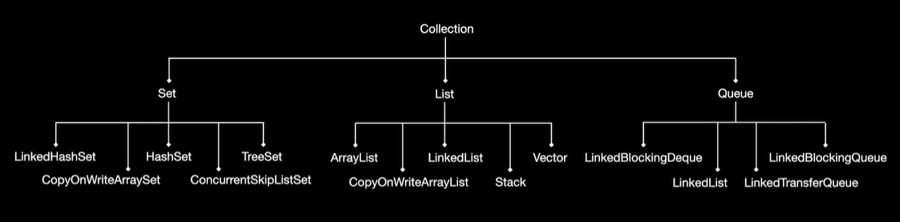

# Collection



```java
import java.util.ArrayList;
import java.util.HashSet;
import java.util.List;
import java.util.Set;

public final class LibrarySupport {
    public static final void main(String[] args) {
        List<String> list = new ArrayList<>();
        list.add("one");
        list.add("two");
        System.out.println(list.size());
        System.out.println(list);
        list.forEach(value -> System.out.println(value));
        for (String value : list) {
            System.out.println(value);
        }

        Set<String> set = new HashSet<>();
        set.add("one");
        set.add("two");
        set.add("three");
        System.out.println(set.size());
        System.out.println(set);
        set.forEach(value -> System.out.println(value));
        for (String value : set) {
            System.out.println(value);
        }
    }
}

```

