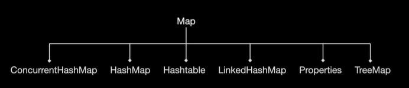

# Map



```java
import java.util.ArrayList;
import java.util.HashMap;
import java.util.HashSet;
import java.util.List;
import java.util.Map;
import java.util.Set;
import java.util.concurrent.ConcurrentHashMap;

public final class LibrarySupport {
    public static final void main(String[] args) {
        Map<Integer, String> dictionary = new HashMap<>();
        // Map<Integer, String> dictionary = new ConcurrentHashMap()<>();
        dictionary.put(1, "one");
        dictionary.put(2, "two");
        dictionary.put(3, "three");
        System.out.println(dictionary.size());
        System.out.println(dictionary);
        dictionary.keySet().forEach(key -> System.out.println(dictionary.get(key)));
        dictionary.values().forEach(value -> System.out.println(value));
        dictionary.values().forEach(System.out::println);
    }
}
```

