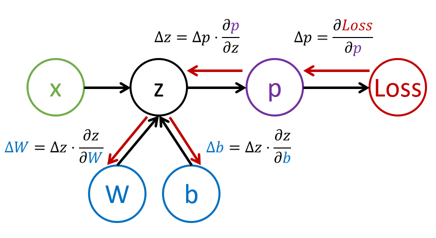

# Multi-Layered Perceptron

## Formalization of Machine Learning

Suppose we have a training dataset **X** with labels **Y**, and we need to build a model *f* that will make most accurate predictions. The quality of predictions is measured by **Loss function** ℒ. The following loss functions are often used:

- For regression problem, when we need to predict a number, we can use **absolute error** ∑i|f(xi)-yi|, or **squared error** ∑i(f(xi)-yi)2
- For classification, we use **0-1 loss** (which is essentially the same as **accuracy** of the model), or **logistic loss**.

For one-level perceptron, function *f* was defined as a linear function *f(x)=wx+b* (here *w* is the weight matrix, *x* is the vector of input features, and *b* is bias vector). For different neural network architectures, this function can take more complex form.

- Initialize parameters by some random values w(0), b(0)
- Repeat the following step many times:

$$
w_{i+1} = w_i - \eta \frac{\partial \mathcal{ℒ}}{\partial w}
$$

$$
b_{i+1} = b_i - \eta \frac{\partial \mathcal{ℒ}}{\partial b}
$$

During training, the optimization steps are supposed to be calculated considering the whole dataset (remember that loss is calculated as a sum through all training samples). However, in real life we take small portions of the dataset called **minibatches**, and calculate gradients based on a subset of data. Because subset is taken randomly each time, such method is called **stochastic gradient descent** (SGD).

## Multi-Layered Perceptrons and Backpropagation

One-layer network, as we have seen above, is capable of classifying linearly separable classes. To build a richer model, we can combine several layers of the network. Mathematically it would mean that the function *f* would have a more complex form, and will be computed in several steps:

- z1=w1x+b1
- z2=w2α(z1)+b2
- f = σ(z2)

Here, α is a **non-linear activation function**, σ is a softmax function, and parameters θ=<*w1,b1,w2,b2*>.

The gradient descent algorithm would remain the same, but it would be more difficult to calculate gradients. Given the chain differentiation rule, we can calculate derivatives as:

$$
\frac{\partial \mathcal{ℒ}}{\partial w_2} = 
\left( \frac{\partial \mathcal{ℒ}}{\partial \sigma} \right)
\left( \frac{\partial \sigma}{\partial z_2} \right)
\left( \frac{\partial z_2}{\partial w_2} \right)
$$

$$
\frac{\partial \mathcal{ℒ}}{\partial w_1} = 
\left( \frac{\partial \mathcal{ℒ}}{\partial \sigma} \right)
\left( \frac{\partial \sigma}{\partial z_2} \right)
\left( \frac{\partial z_2}{\partial \alpha} \right)
\left( \frac{\partial \alpha}{\partial z_1} \right)
\left( \frac{\partial z_1}{\partial w_1} \right)
$$

Note that the left-most part of all those expressions is the same, and thus we can effectively calculate derivatives starting from the loss function and going "backwards" through the computational graph. Thus the method of training a multi-layered perceptron is called **backpropagation**, or 'backprop'.

