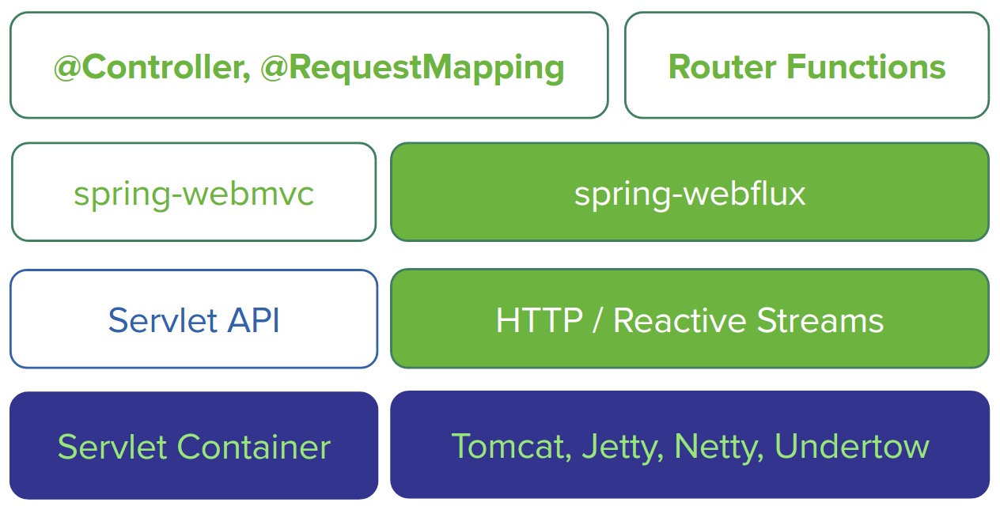

# SpringWebFlux

[参考文档](https://docs.spring.io/spring/docs/5.0.0.RC2/spring-framework-reference/web.html#web-reactive-intro)

## 概览



## Spring Boot Starter

The Spring Boot WebFlux starter available via [http://start.spring.io](https://start.spring.io/) is the fastest way to get started. It does all that’s necessary so you to start writing `@Controller` classes just like with Spring MVC. Simply go to [http://start.spring.io](https://start.spring.io/), choose version 2.0.0.BUILD-SNAPSHOT, and type reactive in the dependencies box. By default the starter runs with Reactor Netty but the dependencies can be changed as usual with Spring Boot to switch to a different runtime. See the Spring Boot reference documentation page for more details and instruction.

This starter also supports the functional web API and will detect automatically `RouterFunction` beans. Your Spring Boot WebFlux application should use the `RouterFunction` **or** the `RequestMapping` approach, it is not possible to mix them in the same application.

## RestAPI

注解 @RestController

The same `@Controller` programming model and the same annotations used in Spring MVC are also supported in WebFlux. The main difference is that the underlying core, framework contracts — i.e. `HandlerMapping`, `HandlerAdapter`, are non-blocking and operate on the reactive `ServerHttpRequest` and `ServerHttpResponse` rather than on the `HttpServletRequest` and `HttpServletResponse`. 

 Below is an example with a reactive controller:

```java
@RestController
public class PersonController {

        private final PersonRepository repository;

        public PersonController(PersonRepository repository) {
                this.repository = repository;
        }

        @PostMapping("/person")
        Mono<Void> create(@RequestBody Publisher<Person> personStream) {
                return this.repository.save(personStream).then();
        }

        @GetMapping("/person")
        Flux<Person> list() {
                return this.repository.findAll();
        }

        @GetMapping("/person/{id}")
        Mono<Person> findById(@PathVariable String id) {
                return this.repository.findOne(id);
        }
}
```

## HttpHandler

相当于 Spring MVC 注解 @RequestMapping

Incoming HTTP requests are handled by a **`HandlerFunction`**, which is essentially a function that takes a `ServerRequest` and returns a `Mono`. 

```java
import static org.springframework.http.MediaType.APPLICATION_JSON;
import static org.springframework.web.reactive.function.BodyInserters.fromObject;

public class PersonHandler {

        private final PersonRepository repository;

        public PersonHandler(PersonRepository repository) {
                this.repository = repository;
        }

        // listPeople is a handler function that returns all Person objects found in the repository as JSON.
        public Mono<ServerResponse> listPeople(ServerRequest request) { 
                Flux<Person> people = repository.allPeople();
                return ServerResponse.ok().contentType(APPLICATION_JSON).body(people, Person.class);
        }

        // createPerson is a handler function that stores a new Person contained in the request body. 
        public Mono<ServerResponse> createPerson(ServerRequest request) { 
                Mono<Person> person = request.bodyToMono(Person.class);
                return ServerResponse.ok().build(repository.savePerson(person));
        }

    
        // 	getPerson is a handler function that returns a single person.
        public Mono<ServerResponse> getPerson(ServerRequest request) { 
                int personId = Integer.valueOf(request.pathVariable("id"));
                Mono<ServerResponse> notFound = ServerResponse.notFound().build();
                Mono<Person> personMono = this.repository.getPerson(personId);
                return personMono
                                .flatMap(person -> ServerResponse.ok().contentType(APPLICATION_JSON).body(fromObject(person)))
                                .switchIfEmpty(notFound);
        }
}
```

## router function

相当于 Spring MVC 注解 @Controller 或者 @RestController

Define a router function that routes to the respective handler functions. 

We use [method-references](https://docs.oracle.com/javase/tutorial/java/javaOO/methodreferences.html) to refer to the handler functions.

```java
import static org.springframework.http.MediaType.APPLICATION_JSON;
import static org.springframework.web.reactive.function.server.RequestPredicates.*;

PersonRepository repository = ...
PersonHandler handler = new PersonHandler(repository);

RouterFunction<ServerResponse> personRoute =
        route(GET("/person/{id}").and(accept(APPLICATION_JSON)), handler::getPerson)
                .andRoute(GET("/person").and(accept(APPLICATION_JSON)), handler::listPeople)
                .andRoute(POST("/person").and(contentType(APPLICATION_JSON)), handler::createPerson);
```

## running a router function in an HTTP server

You can convert a router function into a `HttpHandler` by using `RouterFunctions.toHttpHandler(RouterFunction)`. 

The `HttpHandler` allows you to run on a wide variety of reactive runtimes: Reactor Netty, Servlet 3.1+, and Undertow.

### run a router function in Reactor Netty

```java
RouterFunction<ServerResponse> route = ...
HttpHandler httpHandler = RouterFunctions.toHttpHandler(route);
ReactorHttpHandlerAdapter adapter = new ReactorHttpHandlerAdapter(httpHandler);
HttpServer server = HttpServer.create(HOST, PORT);
server.newHandler(adapter).block();
```

### run a router function in Tomcat

```java
RouterFunction<ServerResponse> route = ...
HttpHandler httpHandler = RouterFunctions.toHttpHandler(route);
HttpServlet servlet = new ServletHttpHandlerAdapter(httpHandler);
Tomcat server = new Tomcat();
Context rootContext = server.addContext("", System.getProperty("java.io.tmpdir"));
Tomcat.addServlet(rootContext, "servlet", servlet);
rootContext.addServletMapping("/", "servlet");
tomcatServer.start();
```

## DispatcherHandler

相当于 SpringMVC 的 `@ControllerAdvice` and/or a `ServletFilter`.

Routes mapped by a router function can be filtered by calling `RouterFunction.filter(HandlerFilterFunction)`, where `HandlerFilterFunction` is essentially a function that takes a `ServerRequest` and `HandlerFunction`, and returns a `ServerResponse`.

 The handler function parameter represents the next element in the chain: this is typically the `HandlerFunction` that is routed to, but can also be another `FilterFunction` if multiple filters are applied.

```java
// Let’s add a simple security filter to our route, 
// assuming that we have a SecurityManager that 
// can determine whether a particular path is allowed:

import static org.springframework.http.HttpStatus.UNAUTHORIZED;

SecurityManager securityManager = ...
RouterFunction<ServerResponse> route = ...

RouterFunction<ServerResponse> filteredRoute =
        route.filter(request, next) -> {
                if (securityManager.allowAccessTo(request.path())) {
                        return next.handle(request);
                }
                else {
                        return ServerResponse.status(UNAUTHORIZED).build();
                }
  });
```

You can see in this example that invoking the `next.handle(ServerRequest)` is optional: we only allow the handler function to be executed when access is allowed.

## Reactive WebSocket Support

WebFlux includes reactive WebSocket client and server support. Both client and server are supported on the Java WebSocket API (JSR-356), Jetty, Undertow, and Reactor Netty.

On the server side, declare a `WebSocketHandlerAdapter` and then simply add mappings to `WebSocketHandler`-based endpoints:

```java
@Bean
public HandlerMapping webSocketMapping() {
        Map<String, WebSocketHandler> map = new HashMap<>();
        map.put("/foo", new FooWebSocketHandler());
        map.put("/bar", new BarWebSocketHandler());

        SimpleUrlHandlerMapping mapping = new SimpleUrlHandlerMapping();
        mapping.setOrder(10);
        mapping.setUrlMap(map);
        return mapping;
}

@Bean
public WebSocketHandlerAdapter handlerAdapter() {
        return new WebSocketHandlerAdapter();
}
```

On the client side create a `WebSocketClient` for one of the supported libraries listed above:

```java
WebSocketClient client = new ReactorNettyWebSocketClient();
client.execute("ws://localhost:8080/echo"), session -> {... }).blockMillis(5000);
```

## What 's more

请阅读[文档](https://docs.spring.io/spring/docs/5.0.0.RC2/spring-framework-reference/web.html#web-reactive-feature-overview)以查看更多

### Request and Response Body Conversion

The `spring-core` module provides reactive `Encoder` and `Decoder` contracts that enable the serialization of a `Flux` of bytes to and from typed objects. The `spring-web` module adds JSON (Jackson) and XML (JAXB) implementations for use in web applications as well as others for SSE streaming and zero-copy file transfer.

### Testing

The `spring-test` module includes a `WebTestClient` that can be used to test WebFlux server endpoints with or without a running server.

Tests without a running server are comparable to `MockMvc` from Spring MVC where mock request and response are used instead of connecting over the network using a socket. The `WebTestClient` however can also perform tests against a running server.

For more see [sample tests](https://github.com/spring-projects/spring-framework/tree/master/spring-test/src/test/java/org/springframework/test/web/reactive/server/samples) in the framework.

## Examples

You will find code examples useful to build reactive Web application in the following projects:

- [Functional programming model sample](https://github.com/poutsma/web-function-sample)
- [Spring Reactive Playground](https://github.com/sdeleuze/spring-reactive-playground): playground for most Spring Web reactive features
- [Reactor website](https://github.com/reactor/projectreactor.io/tree/spring-functional): the `spring-functional` branch is a Spring 5 functional, Java 8 lambda-style application
- [Spring Reactive University session](https://github.com/bclozel/spring-reactive-university): live-coded project from [this Devoxx BE 2106 university talk](https://www.youtube.com/watch?v=Cj4foJzPF80)
- [Reactive Thymeleaf Sandbox](https://github.com/thymeleaf/thymeleafsandbox-biglist-reactive)
- [Mix-it 2017 website](https://github.com/mix-it/mixit/): Kotlin + Reactive + Functional web and bean registration API application
- [Reactor by example](https://github.com/simonbasle/reactor-by-example): code snippets coming from this [InfoQ article](https://www.infoq.com/articles/reactor-by-example)
- [Spring integration tests](https://github.com/spring-projects/spring-framework/tree/master/spring-webflux/src/test/java/org/springframework/web/reactive/result/method/annotation): various features tested with Reactor [`StepVerifier`](https://projectreactor.io/docs/test/release/api/index.html?reactor/test/StepVerifier.html)